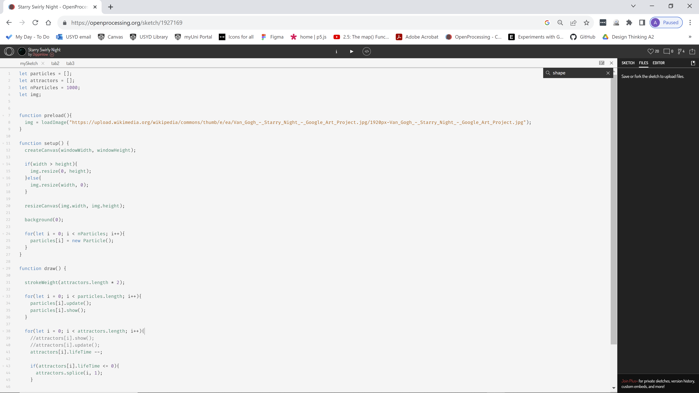

# ashr0086_9103_tu3
Part 1: Imaging Technique Inspiration
Spiral patterns gradually revealing the artwork underneath, combined with a circular digital equivalent of pointillism painting technique, layering together little dots of colour to add to the original image.
I’d like to use all aspects of the example because it’s designed to reveal an underlying artwork, and the circling pointillism effect is created by the user interacting with mouse clicks to contribute to and interact in real-time with the original painting. The swirl is perfect for Van Gogh’s Starry Night in this example, due to the swirls in that painting, but I believe that same swirling effect will create a sense of drama and movement which will complement the brush strokes in several of the set artworks as well.

Part 2: Coding Technique Exploration
As per the available code in the example, using Javascript and P5.js library, the animation is a particle system interacting with attractors. Attractors are created when and where the user clicks the mouse.
The P5 sketch and associated tab2 and tab3 documents sample the colours of the background image. The initial swirling pattern is started by the user's mouse click. In the draw function, a loop updates and shows new particles.
